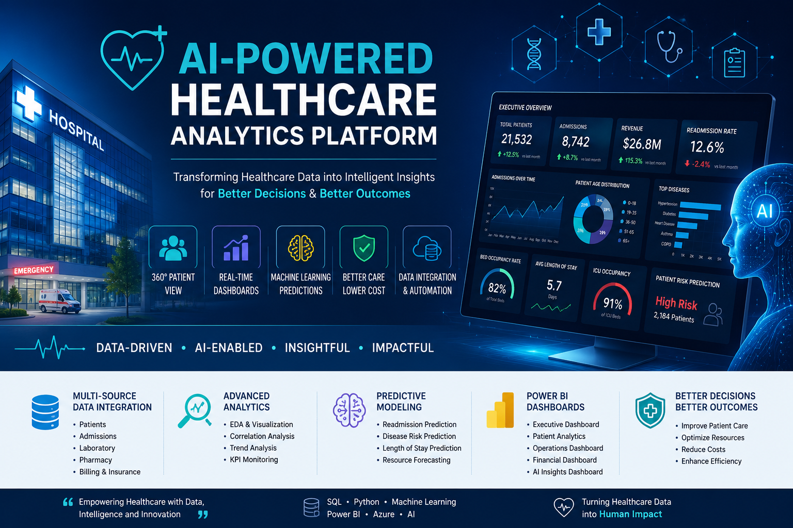

# 🏥 AI-Powered Healthcare Analytics Platform
### End-to-End Data Analytics, Machine Learning & Business Intelligence Solution


---


# 📌 Project Overview

The **AI-Powered Healthcare Analytics Platform** is an end-to-end Healthcare Business Intelligence solution that integrates patient, hospital, laboratory, pharmacy, and billing data to generate actionable insights and predictive analytics.

The project demonstrates the complete data analytics lifecycle—from data collection and preprocessing to machine learning, SQL analytics, and interactive Power BI dashboards.

This platform helps healthcare organizations monitor operational performance, improve patient care, optimize hospital resources, and support executive decision-making using data.

---

# 🎯 Business Problem

Healthcare organizations generate enormous volumes of patient and operational data every day. However, these datasets are often stored in isolated systems, making it difficult for hospital administrators to gain meaningful insights.

### Common Challenges

- High patient readmission rates
- Long waiting times
- Poor bed utilization
- Rising treatment costs
- Limited operational visibility
- Manual reporting
- Difficulty identifying high-risk patients
- Lack of predictive analytics
- Inefficient resource allocation

---

# 💡 Proposed Solution

Build a centralized Healthcare Analytics Platform capable of:

- Integrating multiple healthcare datasets
- Cleaning and transforming healthcare data
- Performing Exploratory Data Analysis (EDA)
- Building Machine Learning models
- Creating interactive Power BI dashboards
- Generating business insights
- Supporting AI-assisted decision making

---

# 🎯 Project Objectives

- Analyze patient demographics
- Monitor hospital admissions
- Analyze healthcare billing
- Evaluate insurance claims
- Track doctor performance
- Predict patient readmissions
- Forecast hospital resource utilization
- Identify high-risk patients
- Build executive dashboards
- Improve healthcare decision-making

---

# 👥 Target Users

- Hospital Administrators
- Healthcare Executives
- Clinical Managers
- Department Heads
- Finance Teams
- Healthcare Analysts
- Data Scientists
- Medical Researchers

---

# 🏥 Domain

**Healthcare Analytics**

- Clinical Analytics
- Operational Analytics
- Financial Analytics
- Business Intelligence
- Predictive Healthcare

---

# 🛠 Technology Stack

## Data Analytics

- SQL
- Python
- Pandas
- NumPy

## Data Visualization

- Power BI
- DAX
- Power Query

## Machine Learning

- Scikit-learn
- Random Forest
- XGBoost
- Logistic Regression
- Linear Regression
- Prophet
- ARIMA

## Data Engineering

- Azure Data Factory
- Azure SQL Database
- AWS S3
- ETL Pipeline

## Development

- Jupyter Notebook
- Git
- GitHub
- VS Code

---

# 📂 Datasets

This project integrates multiple publicly available healthcare datasets.

## Patient Health Records

- Patient ID
- Age
- Gender
- BMI
- Blood Pressure
- Cholesterol
- Heart Rate
- Diagnosis
- Treatment Plan

---

## Hospital Admissions

- Admission Date
- Discharge Date
- Department
- Admission Type
- Waiting Time
- ICU Status
- Length of Stay

---

## Healthcare Billing

- Insurance Provider
- Billing Amount
- Treatment Cost
- Payment Status
- Medication Cost

---

## Heart Disease Dataset

- Age
- Chest Pain
- Blood Pressure
- Cholesterol
- ECG
- Maximum Heart Rate
- Heart Disease

---

# 🏗 Project Architecture

```
Healthcare Datasets
        │
        ▼
Data Collection
        │
        ▼
Data Cleaning & Validation
        │
        ▼
SQL Database
        │
        ▼
Exploratory Data Analysis
        │
        ▼
Feature Engineering
        │
        ▼
Machine Learning Models
        │
        ▼
Power BI Dashboards
        │
        ▼
Business Insights
```

---

# 🔄 Project Workflow

```
Data Collection
      ↓
Data Cleaning
      ↓
SQL Database
      ↓
EDA
      ↓
Feature Engineering
      ↓
Machine Learning
      ↓
Power BI Dashboard
      ↓
Business Insights
      ↓
Executive Report
```

---

# 📊 Exploratory Data Analysis

The project analyzes:

- Patient Demographics
- Disease Distribution
- BMI Trends
- Cholesterol Trends
- Blood Pressure Analysis
- Heart Rate Distribution
- Hospital Admissions
- Department Performance
- Insurance Analysis
- Revenue Analysis
- Waiting Time
- ICU Occupancy

---

# 🤖 Machine Learning Models

## Model 1 — Patient Readmission Prediction

Algorithms

- Logistic Regression
- Random Forest
- XGBoost

Evaluation

- Accuracy
- Precision
- Recall
- F1 Score
- ROC-AUC

---

## Model 2 — Length of Stay Prediction

Algorithms

- Linear Regression
- Random Forest Regressor

Evaluation

- RMSE
- MAE
- R² Score

---

## Model 3 — Disease Prediction

Algorithms

- Random Forest
- XGBoost

Evaluation

- Accuracy
- Precision
- Recall
- Confusion Matrix

---

## Model 4 — Hospital Resource Forecasting

Algorithms

- Prophet
- ARIMA

Forecast

- Bed Occupancy
- Patient Admissions
- ICU Demand

---

# 🗄 SQL Analysis

Business Queries include:

- Top Diseases
- Monthly Admissions
- Revenue Analysis
- Insurance Claims
- Readmission Rate
- Department KPIs
- Doctor Performance
- Average Length of Stay
- ICU Occupancy
- High-Risk Patients

---

# 📈 Power BI Dashboard

## Executive Dashboard

KPIs

- Total Patients
- Total Admissions
- Revenue
- Readmission Rate
- Average Length of Stay
- Occupancy Rate
- Mortality Rate

---

## Patient Analytics

- Age Distribution
- Gender Analysis
- Disease Trends
- BMI Categories
- High-Risk Patients

---

## Hospital Performance

- Department Performance
- Doctor Performance
- ICU Occupancy
- Waiting Time
- Bed Utilization

---

## Financial Dashboard

- Revenue
- Insurance Claims
- Treatment Cost
- Profit Margin

---

## AI Dashboard

Displays:

- Readmission Risk
- Disease Prediction
- Patient Risk Score
- Length of Stay Prediction

---

# 📈 Business Insights

Examples

- Cardiology has the highest readmission rate.
- Diabetes patients incur higher treatment costs.
- ICU occupancy exceeds recommended capacity during seasonal outbreaks.
- Emergency admissions account for the majority of hospital activity.
- Machine Learning models identify high-risk patients before discharge.
- Executive dashboards support faster decision-making.

---

# 📊 Expected Outcomes

- Improve operational efficiency
- Reduce manual reporting
- Support predictive healthcare
- Enhance patient care
- Optimize hospital resources
- Enable executive decision-making
- Demonstrate end-to-end analytics workflow

---

# 📂 Repository Structure

```
AI-Powered-Healthcare-Analytics/
│
├── README.md
│
├── datasets/
│   ├── patient_health_records.csv
│   ├── healthcare_dataset.csv
│   ├── hospital_admissions.csv
│   └── heart.csv
│
├── sql/
│   ├── database_schema.sql
│   ├── analytical_queries.sql
│   └── views.sql
│
├── python/
│   ├── 01_data_cleaning.ipynb
│   ├── 02_eda.ipynb
│   ├── 03_feature_engineering.ipynb
│   ├── 04_machine_learning.ipynb
│   ├── 05_model_evaluation.ipynb
│   └── requirements.txt
│
├── powerbi/
│   └── Healthcare_Analytics.pbix
│
├── dashboards/
│   ├── executive_dashboard.png
│   ├── patient_dashboard.png
│   ├── operations_dashboard.png
│   ├── financial_dashboard.png
│   └── ai_dashboard.png
│
├── architecture/
│   ├── system_architecture.png
│   ├── data_pipeline.png
│   └── er_diagram.png
│
├── reports/
│   ├── Business_Report.pdf
│   └── Project_Presentation.pptx
│
└── LICENSE
```

---

# 🚀 Installation

```bash
git clone https://github.com/yourusername/AI-Powered-Healthcare-Analytics.git

cd AI-Powered-Healthcare-Analytics

pip install -r requirements.txt
```

---

# ▶️ Run the Project

1. Execute SQL scripts to create the database.
2. Run the Python notebooks for preprocessing, EDA, and machine learning.
3. Open the Power BI `.pbix` file.
4. Refresh the data model.
5. Explore the interactive dashboards.

---

# 📌 Future Enhancements

- Real-time Electronic Health Record (EHR) integration
- IoT-based patient monitoring
- Cloud deployment on Azure or AWS
- AI chatbot for healthcare insights
- Streamlit web application
- Automated email reporting
- Predictive staffing recommendations

---

# 👩‍💻 Author

**Nusrat Gulbarga**

**Data Analyst | Business Intelligence | AI & Healthcare Analytics**

- 📧 Email: nusratdataanalyst@gmail.com
- 💼 LinkedIn: *https://www.linkedin.com/in/nusratgulbarga/*
- 💻 GitHub: *https://github.com/NusratGulbarga*

---

# ⭐ If you found this project useful, consider giving it a Star!
